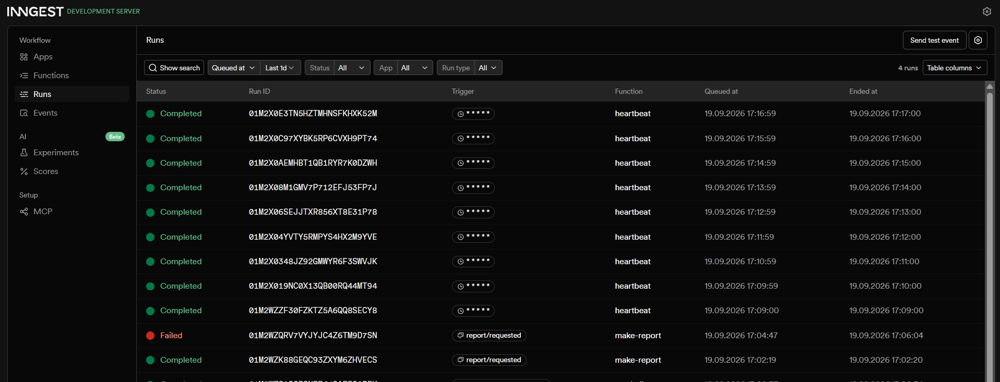

# Your First Background Job (FlyRank Assignment)

A small API whose slow work happens in a background job, built with FastAPI
and Inngest. The endpoint answers instantly; a status endpoint reports
progress; a cron job runs on the clock alone.

## How to run

You need two terminals running at the same time.

Terminal 1 — the API:

   python -m venv .venv
   .venv\Scripts\activate
   pip install fastapi uvicorn inngest
   uvicorn main:app --reload

Terminal 2 — the Inngest Dev Server (requires Node.js):

   npx inngest-cli@latest dev -u http://localhost:8000/api/inngest

Then open the dashboard at http://localhost:8288 to watch runs.

## Endpoints and functions

| Type | Name | Trigger | What it does |
|---|---|---|---|
| Endpoint | `GET /health` | HTTP | Returns `{"status": "ok"}` |
| Endpoint | `POST /reports` | HTTP | Accepts `{"topic": "..."}`, returns 202 + id instantly, sends `report/requested` event. 400 if `topic` is missing. |
| Endpoint | `GET /reports/{id}` | HTTP | Returns the report's current state: `pending` then `done` + result. 404 if unknown id. |
| Function | `say-hello` | event `test/hello` | Sleeps 5s, returns a greeting — first Inngest function, used to verify the wiring. |
| Function | `make-report` | event `report/requested` | Sleeps 8s (stand-in for slow work), then builds the report. Retries twice on failure (`topic: "fail"` triggers this on purpose). |
| Function | `heartbeat` | cron `* * * * *` | Runs every minute with no request involved. Logs a summary of pending/done/failed report counts. |

## 202-then-poll proof

POST returns in well under a second:

   curl -i -X POST http://localhost:8000/reports -H "Content-Type: application/json" -d "{\"topic\":\"cats\"}"
   HTTP/1.1 202 Accepted
   {"id":"2e5d95fc","status":"pending"}

Polling right after shows pending; polling ~10s later shows done:

   curl -i http://localhost:8000/reports/2e5d95fc
   HTTP/1.1 200 OK
   {"id":"2e5d95fc","result":"Report about 'cats' generated at 2026-09-19 17:02:19","status":"done","topic":"cats"}

## Stage 3 note

A retry is the right response to a temporary failure — a flaky network call
or a service hiccup might succeed on the second try. A missing `topic` will
never succeed no matter how many times it's retried, so it's rejected at the
door with a 400 instead of being queued as a job.

## Stage 4 note

Every day at 08:00: `0 8 * * *`. Every Sunday at 22:00: `0 22 * * 0`
(both built and verified on crontab.guru).

## Dashboard screenshot

